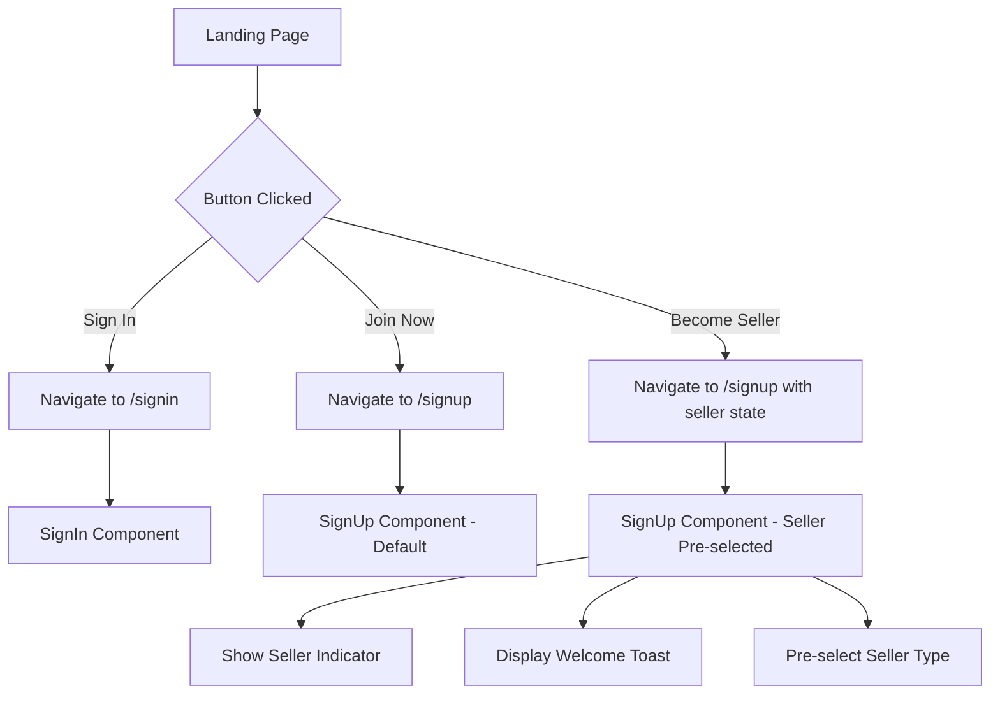

# BrewNear Navigation Updates

## Overview

This document outlines the comprehensive navigation updates implemented for the BrewNear landing page, ensuring proper routing, state management, and accessibility compliance.

## ✅ Completed Updates

### 1. Landing Page Navigation

#### Sign In Button
- **Route**: Direct navigation to `/signin`
- **Implementation**: Uses `handleSignIn()` with error handling
- **Features**:
  - Smooth transitions with loading states
  - Error boundary protection
  - Analytics tracking
  - Accessibility attributes (`aria-label`)

#### Join Now/Sign Up Button
- **Route**: Direct navigation to `/signup`
- **Implementation**: Uses `handleSignUp()` with error handling
- **Features**:
  - Consistent styling and transitions
  - Error handling with user feedback
  - Analytics tracking

#### Become a Seller Button
- **Route**: Navigation to `/signup` with pre-selected seller type
- **Implementation**: Uses `handleBecomeASeller()` with state passing
- **State Management**:
  ```typescript
  navigate("/signup", { 
    state: { 
      userType: "seller",
      source: "landing_become_seller" 
    } 
  });
  ```
- **Features**:
  - Pre-selects "seller" user type in signup form
  - Shows helpful indicator text
  - Maintains state throughout signup flow

### 2. Enhanced SignUp Component

#### State Management
- **Location State Handling**: Reads `userType` from navigation state
- **URL Parameter Support**: Fallback to URL search params
- **Default Behavior**: Defaults to "buyer" if no preference specified

#### User Experience Improvements
- **Pre-selection Indicator**: Shows "(Pre-selected as Seller)" when appropriate
- **Welcome Toast**: Displays helpful message for seller signups
- **Dynamic Button Text**: Changes based on selected user type
- **Loading States**: Proper loading spinners and disabled states

#### Accessibility Enhancements
- **ARIA Labels**: All form inputs have proper `aria-label` attributes
- **Error Associations**: Errors linked with `aria-describedby`
- **Role Attributes**: Error messages have `role="alert"`
- **Keyboard Navigation**: Full keyboard accessibility support
- **AutoComplete**: Proper `autocomplete` attributes for form fields

### 3. Error Handling & Loading States

#### Error Boundary
- **Component**: `ErrorBoundary.tsx`
- **Features**:
  - Catches navigation errors
  - Provides user-friendly error messages
  - Retry and home navigation options
  - Development error details

#### Loading Components
- **ButtonLoading**: Spinner for button loading states
- **PageLoading**: Full-page loading component
- **LoadingSpinner**: Configurable spinner with variants

#### Navigation Helpers
- **File**: `src/utils/navigationHelpers.ts`
- **Features**:
  - Centralized navigation logic
  - Error handling wrapper
  - Analytics integration
  - Type-safe navigation state

### 4. Testing & Validation

#### Navigation Test Utilities
- **File**: `src/utils/navigationTest.ts`
- **Features**:
  - Automated navigation testing
  - Form validation testing
  - Accessibility testing
  - URL parameter validation

#### Development Test Panel
- **Component**: `NavigationTestPanel.tsx`
- **Features**:
  - Live navigation testing
  - Current route display
  - State inspection
  - Validation test runner
  - Only visible in development

## 🔧 Technical Implementation

### Navigation Flow



### State Management

```typescript
interface NavigationState {
  userType?: 'buyer' | 'seller';
  source?: string;
  returnTo?: string;
}

// Example usage
navigate("/signup", { 
  state: { 
    userType: "seller",
    source: "landing_become_seller" 
  } 
});
```

### Error Handling

```typescript
const navigationHelpers = createNavigationHelpers(navigate, (error) => {
  toast({
    title: "Navigation Error",
    description: "Unable to navigate. Please try again.",
    variant: "destructive",
  });
});
```

## 🧪 Testing Instructions

### Manual Testing

1. **Sign In Navigation**:
   - Click "Sign In" button on landing page
   - Verify navigation to `/signin`
   - Check for smooth transition

2. **Sign Up Navigation**:
   - Click "Join Now" button
   - Verify navigation to `/signup`
   - Confirm default "buyer" selection

3. **Seller Sign Up**:
   - Click "Become a Seller" button
   - Verify navigation to `/signup`
   - Confirm "seller" is pre-selected
   - Check for indicator text
   - Verify welcome toast appears

4. **Form Validation**:
   - Test all form fields with invalid data
   - Verify error messages appear
   - Check accessibility with screen reader
   - Test keyboard navigation

### Automated Testing

1. **Development Panel**:
   - Open app in development mode
   - Use test panel in bottom-right corner
   - Run validation tests
   - Test navigation buttons

2. **Console Testing**:
   ```javascript
   import { navigationTester } from './src/utils/navigationTest';
   navigationTester.runAllTests();
   navigationTester.logResults();
   ```

## 🎯 Accessibility Compliance

### WCAG 2.1 AA Standards

- ✅ **Keyboard Navigation**: All interactive elements accessible via keyboard
- ✅ **Screen Reader Support**: Proper ARIA labels and descriptions
- ✅ **Error Identification**: Clear error messages with proper associations
- ✅ **Focus Management**: Logical tab order and visible focus indicators
- ✅ **Color Contrast**: Meets minimum contrast requirements
- ✅ **Responsive Design**: Works across all device sizes

### Accessibility Features

- **Form Labels**: All inputs have associated labels
- **Error Messages**: Linked to inputs with `aria-describedby`
- **Button Labels**: Descriptive `aria-label` attributes
- **Loading States**: Announced to screen readers
- **Error Alerts**: Use `role="alert"` for immediate announcement

## 🚀 Production Deployment

### Build Verification

1. **Production Build**:
   ```bash
   npm run build
   npm run preview
   ```

2. **Route Testing**:
   - Test all navigation paths
   - Verify state persistence
   - Check error handling

3. **Performance**:
   - Verify smooth transitions
   - Check loading states
   - Test on slow connections

### Environment Configuration

- **Development**: Test panel visible, detailed error messages
- **Production**: Test panel hidden, user-friendly error messages
- **Analytics**: Navigation tracking enabled in production

## 📝 Future Enhancements

1. **Advanced Analytics**: More detailed user journey tracking
2. **A/B Testing**: Test different signup flows
3. **Progressive Enhancement**: Offline navigation support
4. **Internationalization**: Multi-language navigation support
5. **Deep Linking**: Direct links to specific signup types
